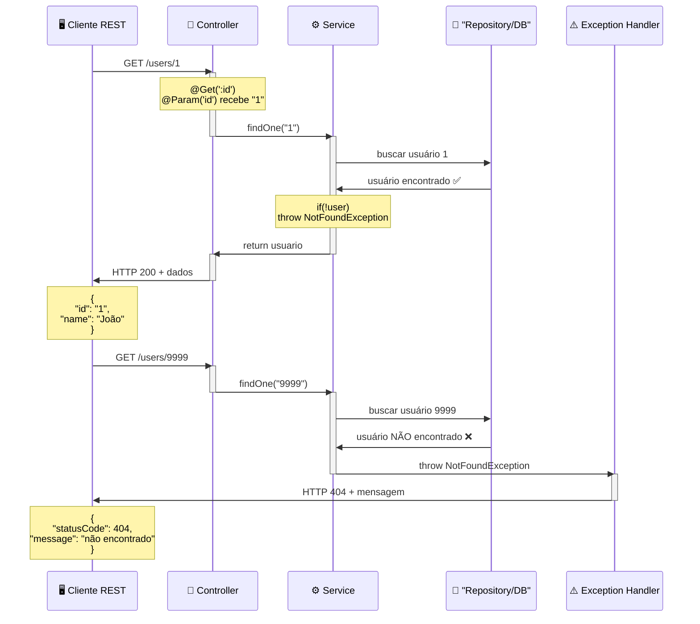
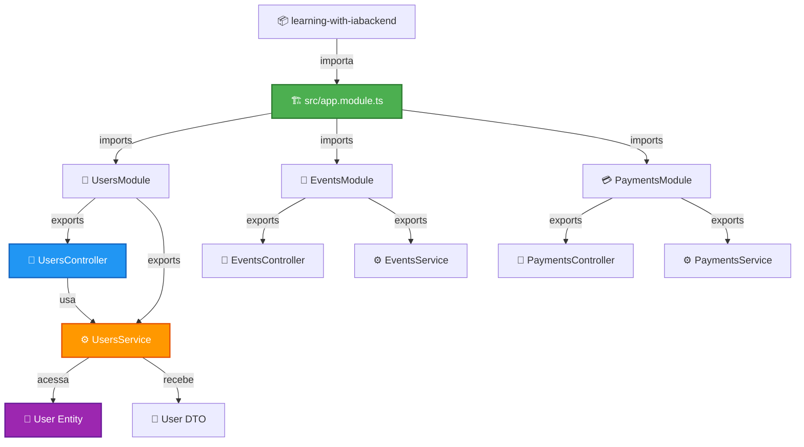
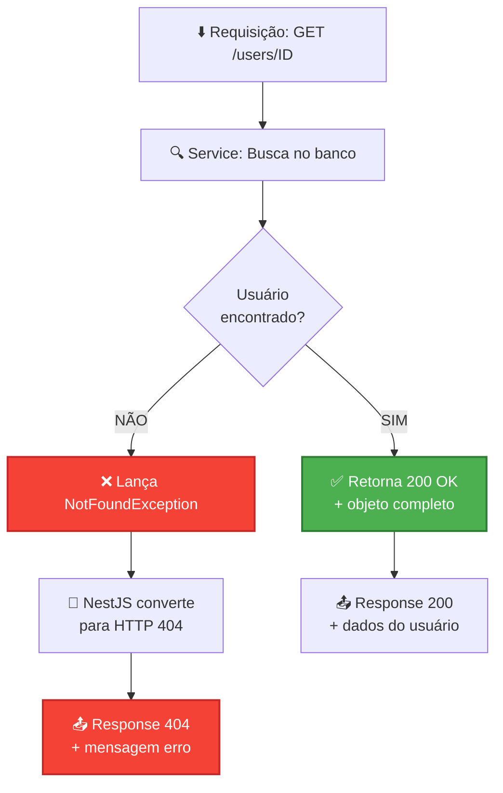
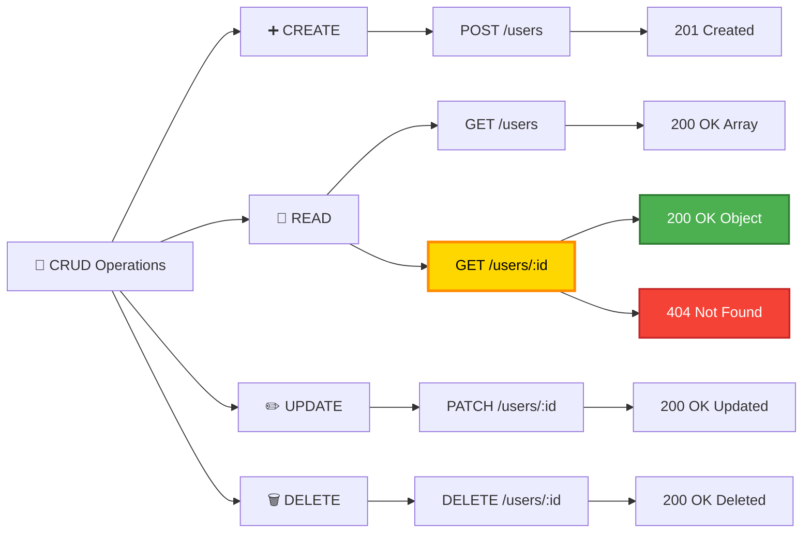
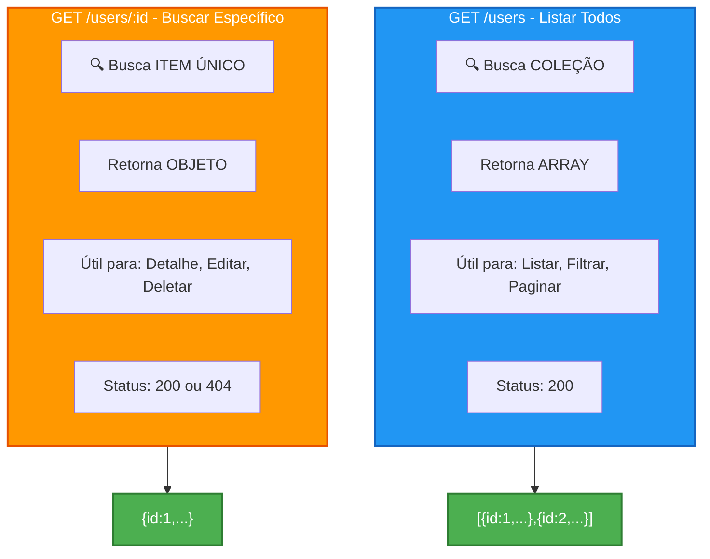
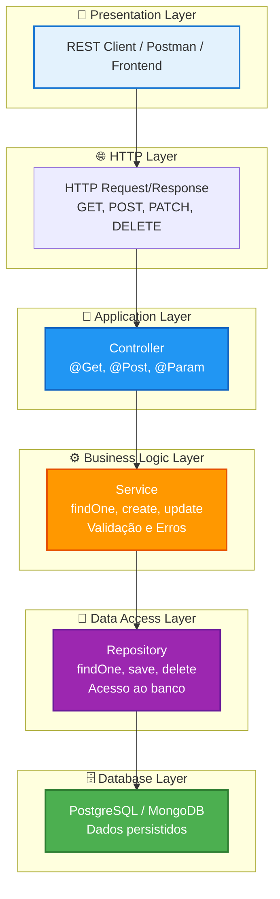
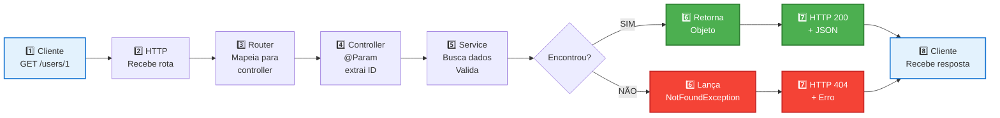
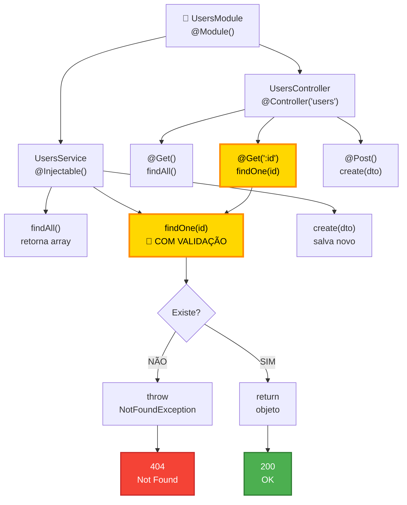

# 📊 Diagramas de Arquitetura e Fluxo

## 🔄 Fluxo Completo GET /:id



---

## 📁 Estrutura de Pastas - Padrão Modular



---

## 🔀 Decisão no Service: Encontrar vs Não Encontrar



---

## 🎯 Mapeamento HTTP Methods para CRUD



---

## 📊 Comparação: GET / vs GET /:id



---

## 🏗️ Camadas da Arquitetura



---

## 🔄 Fluxo Completo de uma Requisição



---

## 📝 Estrutura de Um Módulo Completo



---

**📌 Nota:** Todos esses fluxos e diagramas ajudam a entender como seu código funciona. O conceito principal é:

```
GET /:id → Busca ITEM ESPECÍFICO → 200 (encontrado) ou 404 (não encontrado)
```

